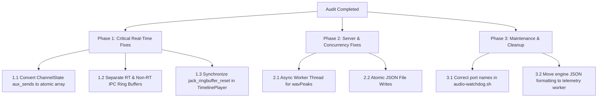

# AES67-Deck Comprehensive Code Audit & Architecture Report

**Date:** 2026-08-29  
**Target:** AES67-Deck (`engine/`, `server/`, `ui/`, `scripts/`, `deploy/`)

---

## 1. Executive Summary

AES67-Deck is a low-latency live mixing console and multitrack DAW for Linux. It combines a C++ real-time DSP engine (running as a JACK/PipeWire client with lock-free audio processing, LV2 plugin hosting, multitrack WavPack capture, and disk streaming), a Node.js/TypeScript bridge server (handling session persistence, IPC forwarding, REST proxying to `aes67-linux-daemon`, and REAPER `.rpp` exports), and a touch-first React/TypeScript single-page application.

This audit conducted an in-depth line-by-line inspection of all subsystems to evaluate:
1. Real-time audio safety and lock-free thread correctness
2. Concurrency and data races across threads and processes
3. Security posture (injection, path traversal, IPC allow-lists)
4. Systemd, kernel, and PipeWire appliance deployment robustness

### Vulnerability & Defect Summary

| Severity | Component | Issue | Impact | Status |
| :--- | :--- | :--- | :--- | :--- |
| **CRITICAL** | C++ Engine | Multi-producer race on SPSC ringbuffer (`tx_buffer_`) | Memory corruption, torn telemetry frames | Unpatched |
| **CRITICAL** | C++ Engine | Data race on `std::map<int, float> aux_sends` | Undefined behavior / crash on RT audio thread | Unpatched |
| **HIGH** | C++ Engine | Non-atomic `jack_ringbuffer_reset` in `TimelinePlayer` | Audio glitch / race condition during seek | Unpatched |
| **HIGH** | C++ Engine | `DiskWriter` thread safety during `start_recording` | Concurrent buffer reallocation hazard | Unpatched |
| **HIGH** | Node Server | Synchronous `execFileSync('wvunpack')` in `wavPeaks.ts` | Node.js event loop freeze on large takes | Unpatched |
| **MEDIUM** | C++ Engine | Heavy JSON formatting (`snprintf`) in RT audio callback | Reduced RT quantum headroom | Unpatched |
| **MEDIUM** | Scripts | Stale JACK port names in `audio-watchdog.sh` (`in_1` vs `in_1_L`) | Failed loopback routing restoration | Unpatched |
| **LOW** | Node Server | Non-atomic file persistence on debounced writes | Potential partial JSON file on hard shutdown | Unpatched |
| **LOW** | Scripts | Hardcoded paths in helper scripts (`/home/ck/...`) | Portability issue across environments | Unpatched |

---

## 2. Architecture & Subsystem Analysis

```
 ┌────────────────────────┐      Unix Socket        ┌─────────────────────────┐      WebSocket :8081      ┌─────────────────────────┐
 │   C++ DSP & RT Engine  │  ◀────────────────────▶ │   Node/TS Bridge Server │  ◀──────────────────────▶ │   React + Vite SPA UI   │
 │   (JACK/PipeWire RT)   │   /tmp/aes67_deck.sock  │   (Session & Hardware)  │                           │   (Mixer / DAW / Patch) │
 └────────────────────────┘                         └─────────────────────────┘                           └─────────────────────────┘
              │                                                  │
       JACK / PipeWire                                 Persisted Session State
  AES67 via RAVENNA Driver                        (mixer_state, fx_racks, projects,
    + aes67-linux-daemon                          records, patchbay_config, rx/tx)
```

### Subsystem Overview:
- **`engine/` (C++20, JACK, Lilv, Sndfile, WavPack)**: Lock-free audio callback graph processing 32 input channels, 8 aux buses, Master, Monitor, and Talkback mic. Features dynamic LV2 hosting, real-time Goertzel RTA analysers, BS.1770-4 K-weighted loudness metering, LTC/MTC timecode generator/decoder, multitrack disk capture, and timeline disk streaming.
- **`server/` (Node.js, TypeScript, ws, PipeWire CLI)**: Central state coordinator. Serves the WebSocket API, translates UI commands to engine IPC, manages filesystem persistence with debounced JSON writes, parses/generates REAPER `.rpp` files, proxies the AES67 daemon REST API, and converges PipeWire patchbay routes.
- **`ui/` (React 18, Vite, Tailwind CSS, Zustand)**: Fast, touch-friendly UI with Mixer, Timeline DAW, and Patchbay views. Utilizes a dual-canvas render architecture decoupled from React state to achieve smooth 60 FPS playback and metering.
- **`deploy/` & `scripts/` (Bash, Systemd, DKMS, PipeWire, nginx)**: Appliance automation. Configures CPU governors, real-time limits, PipeWire 48 kHz / 128 quantum tuning, RAVENNA ALSA DKMS module signing, and systemd user services.

---

## 3. Deep-Dive Audit Findings

---

### A. C++ Real-Time DSP Engine (`engine/`)

#### 1. [CRITICAL] Multi-Producer Race on Single-Producer `tx_buffer_`
- **File**: `engine/src/ipc/IpcClient.cpp` (lines 46–63) & `engine/src/main.cpp` (lines 577, 643, 685, 697, 710)
- **Root Cause**:
  `IpcClient::tx_buffer_` is allocated using `jack_ringbuffer_create()`, which is strictly a **Single-Producer, Single-Consumer (SPSC)** lock-free ring buffer.
  - **Producer 1 (RT Audio Thread)** calls `ipc.send_multichannel_metering()` every ~25 ms from `jack.set_process_callback`.
  - **Producer 2 (IPC Thread)** calls `ipc.send_json()` from `ipc.set_transport_callback` upon receiving events (`take_started`, `take_finished`, `take_failed`, `bounce_start`, etc.).
- **Impact**:
  Simultaneous calls to `jack_ringbuffer_write()` by both threads corrupt the internal write pointer and tear JSON message payloads, leading to dropped messages or corrupted IPC data streams.
- **Remediation**:
  Provide separate SPSC ring buffers for the RT audio thread and the IPC worker thread, or protect non-RT replies with a dedicated mutex-protected queue.

```cpp
// Suggested fix in IpcClient:
// Separate RT telemetry ring from non-RT async IPC queue
void IpcClient::send_multichannel_metering(const std::string& json_payload); // Audio thread only
void IpcClient::send_json_async(const std::string& json_payload);            // Non-RT thread with mutex
```

---

#### 2. [CRITICAL] Data Race on `std::map<int, float> aux_sends` Across Threads
- **File**: `engine/src/main.cpp` (line 498 vs lines 1218–1222)
- **Root Cause**:
  In `main.cpp`, `channels` is defined as `std::map<int, ChannelState> channels;`.
  Inside `ChannelState`, `aux_sends` is a `std::map<int, float>`.
  - On the **IPC thread**, `set_command_callback` executes:
    ```cpp
    channels[channel_id].aux_sends[bus_id] = value;
    ```
    This inserts or modifies tree nodes in the `std::map`.
  - On the **RT audio thread**, every audio quantum processes:
    ```cpp
    float master_send = (st.aux_sends.count(MASTER_ID) ? st.aux_sends[MASTER_ID] : 0.75f) / 0.75f;
    float b_send[NUM_AUX] = {0.0f};
    for (int b = 0; b < NUM_AUX; b++) {
        b_send[b] = (st.aux_sends.count(AUX_BASE + b) ? st.aux_sends[AUX_BASE + b] : 0.0f) / 0.75f;
    }
    ```
- **Impact**:
  `std::map` is not thread-safe. Concurrent tree traversal while another thread performs node insertion/rebalancing causes tree corruption, infinite loops, and segmentation faults inside the real-time audio callback.
- **Remediation**:
  Replace `std::map<int, float>` with a fixed-size `std::array<std::atomic<float>, NUM_AUX + 1>` or flat atomic array indexed by bus ID.

```cpp
// Suggested fix in ChannelState:
struct ChannelState {
    std::atomic<float> fader{0.75f};
    std::atomic<float> pan{0.0f};
    std::atomic<bool> mute{false};
    std::atomic<bool> solo{false};
    std::atomic<bool> phase{false};
    
    // Fixed array replacing std::map
    std::atomic<float> aux_sends[NUM_AUX + 1]{}; // 0 = Master, 1..8 = Aux 101..108
    ...
};
```

---

#### 3. [HIGH] Non-Atomic `jack_ringbuffer_reset` in `TimelinePlayer`
- **File**: `engine/src/playback/TimelinePlayer.cpp` (line 308)
- **Root Cause**:
  In `reader_loop()`, seeking or transport discontinuity triggers:
  ```cpp
  jack_ringbuffer_reset(tracks_[t]->ring);
  ```
  `jack_ringbuffer_reset` non-atomically writes `write_ptr = read_ptr = 0`. Meanwhile, the JACK audio thread in `TimelinePlayer::render()` is concurrently executing `jack_ringbuffer_read_space()` and `jack_ringbuffer_read()`.
- **Impact**:
  The audio thread can read corrupted pointer offsets, leading to reading invalid memory or producing audible audio transients/clicks.
- **Remediation**:
  Perform ring resets on the audio thread or signal a sequence counter that the audio thread checks before reading.

---

#### 4. [HIGH] `DiskWriter` State Race During `start_recording`
- **File**: `engine/src/recorder/DiskWriter.cpp` (lines 39–81) & `engine/src/main.cpp` (line 1442)
- **Root Cause**:
  In `main.cpp`, `recorder.write_audio(master_bufs, 2, nframes);` is called every audio cycle. When `start_recording` is called on the IPC thread, `interleave_buffer_.resize(...)` is executed while `write_audio` may concurrently access `interleave_buffer_`.
- **Remediation**:
  Pre-allocate `interleave_buffer_` in the `DiskWriter` constructor to the maximum block size (`MAX_NFRAMES * channels`) so `start_recording` never resizes vectors dynamically.

---

#### 5. [MEDIUM] Telemetry String Formatting on Real-Time Callback Thread
- **File**: `engine/src/main.cpp` (lines 1519–1700)
- **Root Cause**:
  Every ~25 ms, the audio thread formats a 2 KB to 32 KB JSON telemetry payload using `snprintf`, computing `std::log10` for 42 channels, 31 RTA Goertzel bins, 48 goniometer coordinates, and waveform peak envelopes.
- **Impact**:
  While `meter_json` is pre-allocated (no dynamic memory allocations), performing extensive string conversions on the RT audio callback consumes CPU cycles and reduces headroom at low buffer quantums (e.g. 64 or 128 frames @ 48 kHz).
- **Remediation**:
  Push raw binary structs (`float` arrays) across a lock-free ringbuffer to a dedicated telemetry worker thread that serializes JSON off the audio thread.

---

### B. Node.js Bridge Server (`server/`)

#### 1. [HIGH] Synchronous `execFileSync` Event Loop Blocking in `wavPeaks.ts`
- **File**: `server/src/wavPeaks.ts` (line 29)
- **Root Cause**:
  When a client requests waveform peaks via `get_clip_peaks`, `readAudio()` invokes `execFileSync('wvunpack', ...)` and reads large WAV files synchronously.
  ```typescript
  execFileSync('wvunpack', ['-y', '-q', '-w', filePath, '-o', tmp], { stdio: 'ignore' });
  const out = parseWav(fs.readFileSync(tmp));
  ```
- **Impact**:
  For multitrack takes with 32 channels of 30-minute recordings, executing `wvunpack` and peak parsing synchronously blocks the Node.js event loop for seconds. This causes WebSocket packet queueing, missed PTP health checks, and delayed mixer state synchronization.
- **Remediation**:
  Offload `wvunpack` and peak extraction to Node.js `worker_threads` or asynchronous `child_process.execFile` with streaming parsers.

---

#### 2. Subprocess Security & Path Traversal Verification (PASS)
- **Subprocess Safety**: All process executions (`pw-link`, `pactl`, `wvunpack`) use argument arrays rather than raw shell strings (`execFile` / `execFileSync`). This completely prevents command injection attacks.
- **Path Sanitization**: User-supplied names are strictly sanitized using alphanumeric and underscore filters (`sanitizeProjectName`). Video serving via HTTP verifies directory prefixes (`full.startsWith(projectVideoDir)`) to prevent directory traversal (`../`).
- **Command Allow-List**: Inbound WebSocket commands are filtered against a strict allow-list (`allowedTypes`), dropping unauthorized payload types.

---

#### 3. [LOW] Non-Atomic File Persistence
- **File**: `server/src/index.ts` (lines 375, 540, 638)
- **Observation**:
  Persisted state (`mixer_state.json`, `fx_racks.json`, `project.json`) is written directly using `fs.writeFileSync` inside debounced timers.
- **Impact**:
  If the appliance loses power or the process terminates during a write, the file may be left partially written or corrupted.
- **Remediation**:
  Write to a temporary file in the same directory (`${file}.tmp`) and atomically rename it using `fs.renameSync`.

---

### C. Frontend React UI (`ui/`)

#### 1. Canvas Arrange Surface Architecture (EXCELLENT)
- **File**: `ui/src/daw/ArrangeSurface.tsx` & `ui/src/daw/SurfaceModel.ts`
- **Design Strengths**:
  - Implements a **dual-canvas layer pattern**: a static `canvas` for tracks, grid lines, clips, and waveform tiles that only repaints on structural changes, and an `overlayCanvas` that repaints at 60 FPS for playhead movement.
  - Fully DPR (Device Pixel Ratio) aware for high-DPI/Retina screens.
  - Decoupled from React render cycles: store changes flip a `dirtyRef`, avoiding unnecessary virtual DOM reconciliation.

#### 2. Telemetry Coalescing & Store Design
- **File**: `ui/src/stores/useMixerStore.ts`
- **Design Strengths**:
  - 40 Hz incoming metering frames are coalesced onto `requestAnimationFrame` before updating component state, preventing React re-render cascades.
  - Circular store dependencies are avoided through the `wsBus.ts` shared singleton.

---

### D. Deployment & Automation Scripts (`deploy/` & `scripts/`)

#### 1. [MEDIUM] Stale Jack Port Names in `audio-watchdog.sh`
- **File**: `scripts/audio-watchdog.sh` (lines 44–45)
- **Bug**:
  ```bash
  pw-link "AES67_System_Audio:monitor_FL" "AES67_Deck:in_1" 2>/dev/null
  pw-link "AES67_System_Audio:monitor_FR" "AES67_Deck:in_2" 2>/dev/null
  ```
  In `engine/src/main.cpp`, ports are registered as `in_1_L` and `in_1_R`. Linking to `in_1` and `in_2` fails silently.
- **Fix**: Update targets to `AES67_Deck:in_1_L` and `AES67_Deck:in_1_R`.

---

#### 2. Appliance System Tuning (ROBUST)
- **File**: `deploy/provision-rt.sh` & `deploy/systemd/`
- **Design Strengths**:
  - Configures real-time audio privileges (`rtprio 95`, `memlock infinity` in `/etc/security/limits.d/`).
  - Automatically configures CPU performance governor via systemd unit.
  - Enables kernel parameters `pcie_aspm=off threadirqs` for real-time interrupt handling.
  - Systemd user services (`aes67-deck-engine.service`, `aes67-deck-server.service`) configure `Restart=always` and `StartLimitIntervalSec=0`, ensuring automatic self-healing if JACK or PipeWire restarts.

---

## 4. Prioritized Action Plan



### Implementation Checklist:
- [ ] **Phase 1: Engine Concurrency & RT Safety**
  - [ ] Replace `std::map<int, float> aux_sends` in `ChannelState` with `std::atomic<float> aux_sends[NUM_AUX + 1]`.
  - [ ] Split `IpcClient::tx_buffer_` or synchronize non-RT `send_json` invocations.
  - [ ] Protect `jack_ringbuffer_reset` in `TimelinePlayer.cpp` to prevent data race during locate/seek.
  - [ ] Pre-allocate `DiskWriter::interleave_buffer_` in constructor.
- [ ] **Phase 2: Server Async Processing**
  - [ ] Convert `ensurePeaks` in `server/src/wavPeaks.ts` to asynchronous worker thread execution.
  - [ ] Implement atomic file writing (`${path}.tmp` + `renameSync`).
- [ ] **Phase 3: Script & Port Corrections**
  - [ ] Fix `AES67_Deck:in_1_L` / `R` port naming in `scripts/audio-watchdog.sh`.
